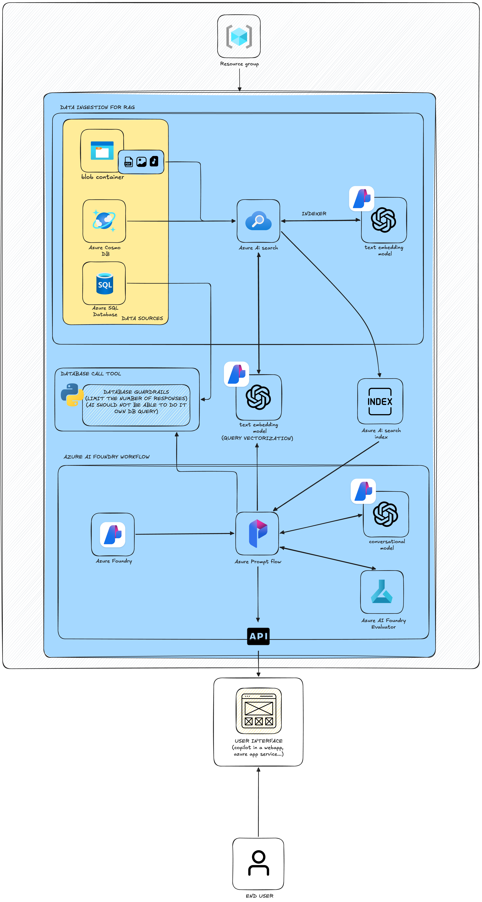

# Outlander Gear Co. AI Product Data Copilot

This repository supports the Outlander Gear Co. team scenario from the AI developer project.  
Goal: build and deploy an AI Product Data Copilot that helps customers quickly access product details, pricing, and comparisons.

Current stack in this repository:
- PostgreSQL
- Node.js and Express with TypeScript
- Angular 19 and Tailwind CSS

The web platform and APIs in this repo provide the business and product data foundation that the copilot will query and use.

---

## Project Introduction

In this project, you step into the role of an AI developer to build a copilot tailored to a real business context.

Selected team:
- Outlander Gear Co. (Product and Retail)

Mission for this team:
- Build a Product Data Copilot that improves the shopping experience through instant access to product information, pricing, and product comparisons.

---

## Project Summary

You will build, test, and deploy a copilot that retrieves relevant information from indexed data and returns accurate, real-time responses.

High-level workflow:
1. Create an AI Studio project and deploy a model to power the copilot.
2. Upload and index relevant data for retrieval.
3. Build a chat copilot flow with Azure AI Foundry Prompt Flow.
4. Test with realistic questions to validate quality and usefulness.
5. Evaluate with manual and automated assessments.
6. Deploy for real usage by customers or internal users.

---

## Azure Architecture

### Diagram



### Architecture Explanation

The diagram represents a Retrieval-Augmented Generation (RAG) and workflow architecture centered on Azure AI Foundry and Azure AI Search.

1. Data ingestion for RAG
- Product knowledge enters from multiple sources such as blob storage, Azure Cosmos DB, and Azure SQL Database.
- Azure AI Search acts as the indexing and retrieval hub.
- A text embedding model is used during indexing to vectorize content and enable semantic retrieval.

2. Query-time retrieval path
- At runtime, user queries are vectorized with the same embedding approach.
- The vectorized query is sent to Azure AI Search.
- Azure AI Search returns relevant chunks from the index to ground the response.

3. Prompt Flow orchestration
- Azure Prompt Flow orchestrates the full response pipeline.
- It combines retrieved context from search with model reasoning from a conversational model.
- It also supports evaluation through Azure AI Foundry evaluator components.

4. Database call tool and guardrails
- A dedicated database tool is available for controlled DB access.
- Guardrails are applied to limit what the AI can query and how much it can return.
- This protects reliability, performance, and data safety.

5. Delivery to user interface
- Prompt Flow exposes an API endpoint.
- The frontend copilot UI (web app or app service endpoint) calls that API.
- The end user interacts with a grounded, domain-specific assistant for product questions.

---

## Local Setup Prerequisites

### 1. Node.js (v18+)

macOS with Homebrew:
```bash
brew install node
```

If Homebrew is not installed:
```bash
/bin/bash -c "$(curl -fsSL https://raw.githubusercontent.com/Homebrew/install/HEAD/install.sh)"
brew install node
```

Verify:
```bash
node --version
npm --version
```

---

### 2. PostgreSQL

macOS with Homebrew:
```bash
brew install postgresql@16
```

Add PostgreSQL to PATH:
```bash
echo 'export PATH="/opt/homebrew/opt/postgresql@16/bin:$PATH"' >> ~/.zshrc
source ~/.zshrc
```

Start PostgreSQL:
```bash
brew services start postgresql@16
```

Verify:
```bash
psql --version
createdb --version
```

Alternative without Homebrew:
- https://www.postgresql.org/download/macosx/
- https://postgresapp.com/

---

### 3. Angular CLI (optional but recommended)

```bash
npm install -g @angular/cli
```

---

## Project Installation and Run Steps

### Step 1: Create and seed the database

```bash
cd website

createdb outlander_gear
psql -d outlander_gear -f database/schema.sql
psql -d outlander_gear -f database/seed.sql
```

If createdb fails with role does not exist:
```bash
psql postgres -c "CREATE ROLE $(whoami) WITH LOGIN SUPERUSER;"
```

Verify data load:
```bash
psql -d outlander_gear -c "SELECT count(*) FROM products;"
```

Expected products count: 21

---

### Step 2: Configure and run backend

```bash
cd backend
npm install
```

Update backend/.env:

```env
DB_HOST=localhost
DB_PORT=5432
DB_USER=your_macos_username
DB_PASSWORD=
DB_NAME=outlander_gear
PORT=3000
JWT_SECRET=outlander-gear-dev-secret-change-me
JWT_EXPIRES_IN=7d
```

Run backend:
```bash
npm run dev
```

Test API quickly:
```bash
curl http://localhost:3000/api/products | head -c 200
```

---

### Step 3: Run frontend

```bash
cd frontend
npm install
npx ng serve
```

Open:
- http://localhost:4200

---

## Test Accounts

| Role   | Email                    | Password   |
|--------|--------------------------|------------|
| Admin  | admin@outlander-gear.co  | Admin1234! |
| Client | marie.dupont@email.com   | Test1234!  |

---

## Repository Structure

```text
website/
├── README.md
├── database/
│   ├── schema.sql
│   └── seed.sql
├── backend/
│   ├── package.json
│   ├── tsconfig.json
│   └── src/
│       ├── server.ts
│       ├── config/database.ts
│       ├── middleware/
│       ├── routes/
│       ├── types/
│       └── validators/
└── frontend/
    ├── package.json
    ├── angular.json
    └── src/app/
        ├── components/
        │   └── chat-copilot/
        ├── services/
        ├── models/
        └── app.routes.ts
```

---

## API Endpoints

| Method | Route                    | Auth | Description                         |
|--------|--------------------------|------|-------------------------------------|
| GET    | /api/products            | No   | Product list with filters and paging |
| GET    | /api/products/featured   | No   | Featured products                   |
| GET    | /api/products/:slug      | No   | Product details                     |
| GET    | /api/categories          | No   | Categories list                     |
| GET    | /api/categories/:slug    | No   | Category details                    |
| POST   | /api/auth/register       | No   | Register user                       |
| POST   | /api/auth/login          | No   | Login and receive JWT               |
| GET    | /api/auth/me             | Yes  | Current user profile                |
| GET    | /api/cart                | Yes  | Read cart                           |
| POST   | /api/cart                | Yes  | Add cart item                       |
| PUT    | /api/cart/:productId     | Yes  | Update cart item quantity           |
| DELETE | /api/cart/:productId     | Yes  | Remove cart item                    |
| DELETE | /api/cart                | Yes  | Clear cart                          |
| GET    | /api/orders              | Yes  | List user orders                    |
| POST   | /api/orders              | Yes  | Create order from cart              |
| GET    | /api/orders/:id          | Yes  | Order details                       |
| GET    | /api/reviews/product/:id | No   | Product reviews                     |
| POST   | /api/reviews/product/:id | Yes  | Create review                       |

---

## Troubleshooting

If psql command is not found:
- PostgreSQL is not in your PATH. Re-check the PostgreSQL prerequisite section.

If FATAL role does not exist:
```bash
psql postgres -c "CREATE ROLE $(whoami) WITH LOGIN SUPERUSER;"
```

If backend starts with ECONNREFUSED:
- PostgreSQL is likely not running.
```bash
brew services start postgresql@16
```

If frontend does not load products:
- Check backend availability with curl http://localhost:3000/api/products
- Check CORS allows localhost:4200 (enabled by default in this project)

If frontend shows Error: Module not found:
```bash
cd frontend && npm install
```
