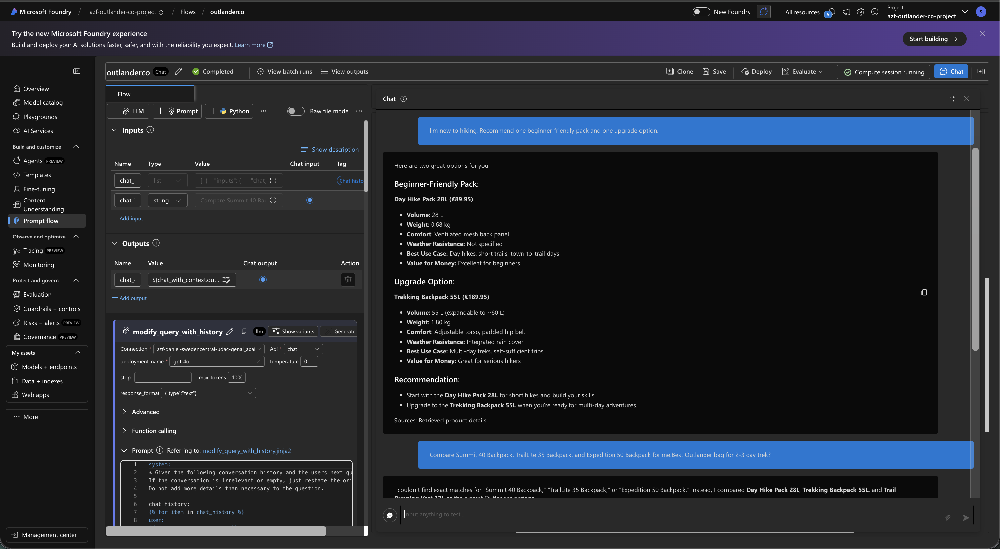
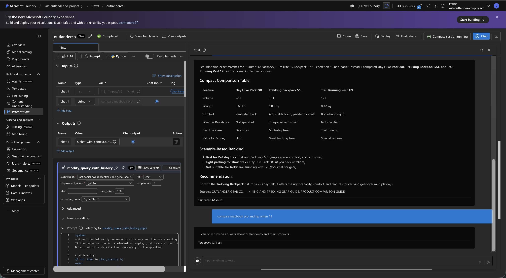
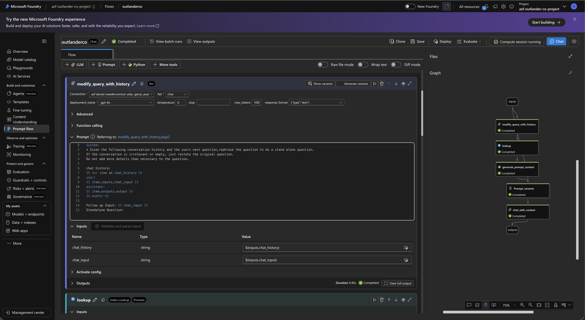
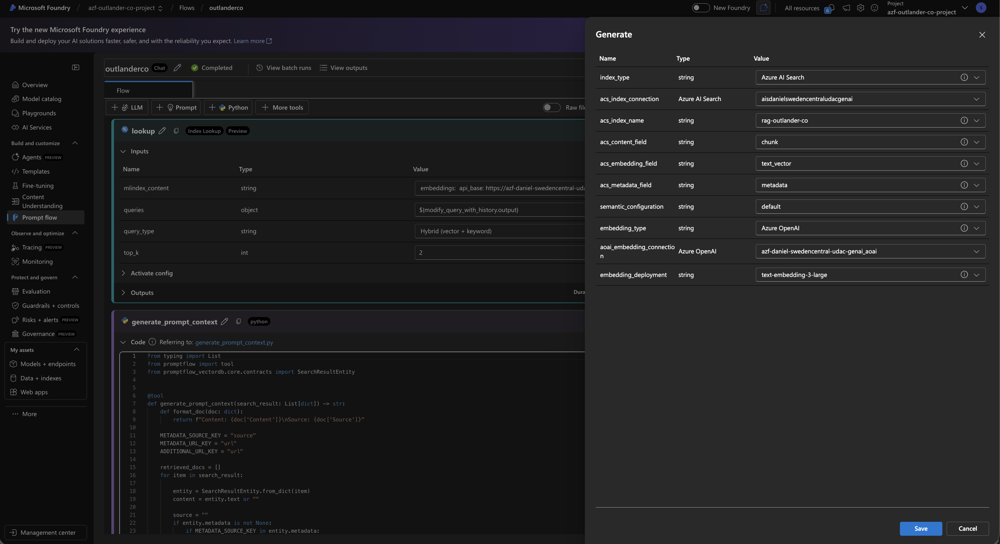
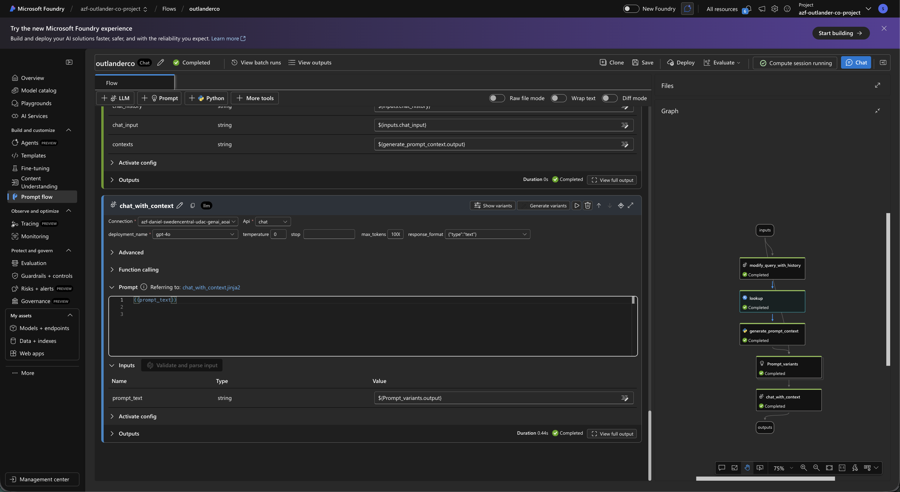
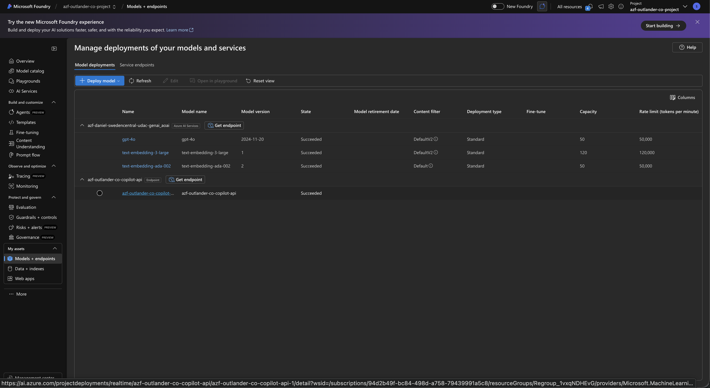
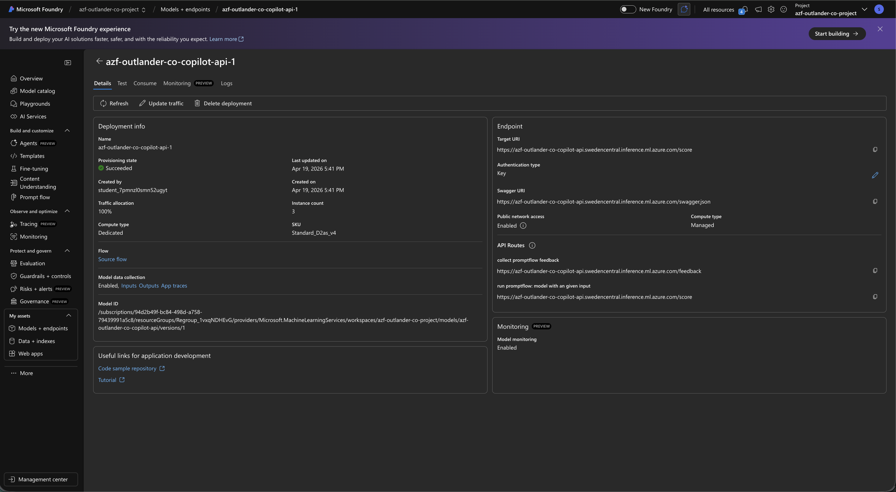

# Outlander Gear Co. — GuideLander AI Copilot

**A full-stack e-commerce platform with a production-grade AI shopping assistant, built end-to-end on Azure AI Foundry.**

---

## Demo

https://github.com/user-attachments/assets/110e0119-6736-481e-9f60-8f68370ef1b8

https://github.com/user-attachments/assets/b0b37cca-c473-4c80-8088-a5042f8e438b

---

## What GuideLander Does

GuideLander is an AI shopping assistant embedded in the Outlander Gear Co. storefront. It answers customer questions grounded exclusively in the brand's own product knowledge — no hallucinations, no competitor mentions, no off-topic drift.

- Compares products side-by-side with spec tables (volume, weight, frame type, rain cover, price)
- Handles fuzzy or invented product names by auto-mapping to the closest catalog match
- Gives scenario-based recommendations (beginner hiker, frequent traveller, one-bag setup)
- Answers policy questions (returns, shipping timelines) directly from indexed documents
- Transparently acknowledges missing specs instead of fabricating them
- Enforces guardrails — competitor comparisons and off-topic queries are refused cleanly

---

## Azure Architecture


The full system is a RAG pipeline deployed as an Azure ML managed endpoint and called by the Angular frontend through an Express proxy route.

**5-node PromptFlow pipeline:**

```
User message
    │
    ▼
[1] modify_query_with_history   ← rewrites the query using chat history for context continuity
    │
    ▼
[2] lookup                      ← Azure AI Search vector lookup (text-embedding-3-large)
    │
    ▼
[3] generate_prompt_context     ← assembles retrieved chunks into a structured context block
    │
    ▼
[4] Prompt_variants             ← injects the GuideLander system prompt + user query + context
    │
    ▼
[5] chat_with_context           ← GPT-4o generates the final grounded response
```

| Layer | Technology |
|-------|-----------|
| AI Orchestration | Azure AI Foundry — PromptFlow |
| Language Model | GPT-4o |
| Embeddings | text-embedding-3-large |
| Vector Search | Azure AI Search |
| Deployment | Azure ML Managed Endpoint (real-time inference) |
| Frontend | Angular 19, Tailwind CSS, Transloco i18n (EN/FR) |
| Backend | Node.js / Express / TypeScript — JWT auth, PostgreSQL, copilot proxy route |
| Database | PostgreSQL — 31 products, categories, reviews, specs |

**RAG knowledge base:** 13 hand-authored documents covering the full product catalog, comparison guides, buying guides, care guides, shipping and returns policy, and FAQ — all indexed and queryable via vector search.

---

## Evaluation

Evaluated on a **16-query test set** using Azure AI Foundry's built-in evaluation framework across coherence, groundedness, fluency, and relevance.

| Category | What it tests |
|---|---|
| Direct comparisons | Table-based product comparisons grounded in catalog data |
| Fuzzy / invented names | Auto-mapping of non-exact product names to catalog |
| Open-ended recommendations | Scenario-based advice (beginner, travel, one-pack) |
| Cross-domain | Mixing product info with policy (returns, shipping) |
| Missing data fields | Requests for specs not present in the indexed documents |
| Competitor / out-of-scope | Guardrail enforcement for off-topic questions |
| Short-form | Abbreviation handling and concise response formatting |

---

## Screenshots

### GuideLander — Live Interactions







---

### PromptFlow Pipeline — Azure AI Foundry









---

### Evaluation Metrics — Azure AI Foundry


---

### Azure ML Endpoint — Deployment Confirmation





---

## Running Locally

### Prerequisites

**Node.js (v18+)**
```bash
brew install node
```

**PostgreSQL**
```bash
brew install postgresql@16
echo 'export PATH="/opt/homebrew/opt/postgresql@16/bin:$PATH"' >> ~/.zshrc
source ~/.zshrc
brew services start postgresql@16
```

**Angular CLI** (optional but recommended)
```bash
npm install -g @angular/cli
```

---

### Step 1 — Database

```bash
createdb outlander_gear
psql -d outlander_gear -f database/schema.sql
psql -d outlander_gear -f database/seed.sql
```

If `createdb` fails with "role does not exist":
```bash
psql postgres -c "CREATE ROLE $(whoami) WITH LOGIN SUPERUSER;"
```

---

### Step 2 — Backend

```bash
cd backend
npm install
```

Create `backend/.env`:
```env
DB_HOST=localhost
DB_PORT=5432
DB_USER=your_macos_username
DB_PASSWORD=
DB_NAME=outlander_gear
PORT=3000
JWT_SECRET=outlander-gear-dev-secret-change-me
JWT_EXPIRES_IN=7d
```

```bash
npm run dev
```

---

### Step 3 — Frontend

```bash
cd frontend
npm install
npx ng serve
```

Open: http://localhost:4200

---

### Test Accounts

| Role | Email | Password |
|------|-------|----------|
| Admin | admin@outlander-gear.co | Admin1234! |
| Client | marie.dupont@email.com | Test1234! |

---

### Troubleshooting

| Symptom | Fix |
|---|---|
| `psql` command not found | Re-check the PostgreSQL PATH export in `.zshrc` |
| `FATAL: role does not exist` | `psql postgres -c "CREATE ROLE $(whoami) WITH LOGIN SUPERUSER;"` |
| Backend starts with `ECONNREFUSED` | `brew services start postgresql@16` |
| Frontend shows no products | `curl http://localhost:3000/api/products` to verify backend is up |
| `Module not found` on frontend | `cd frontend && npm install` |
