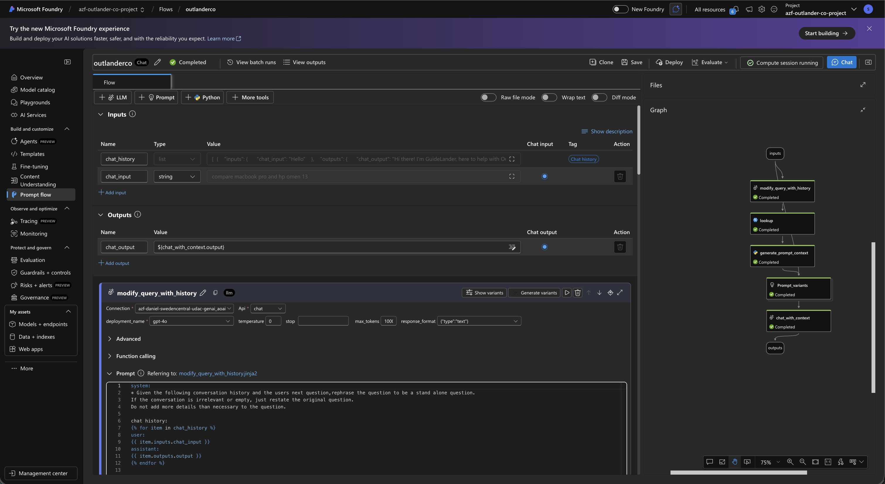
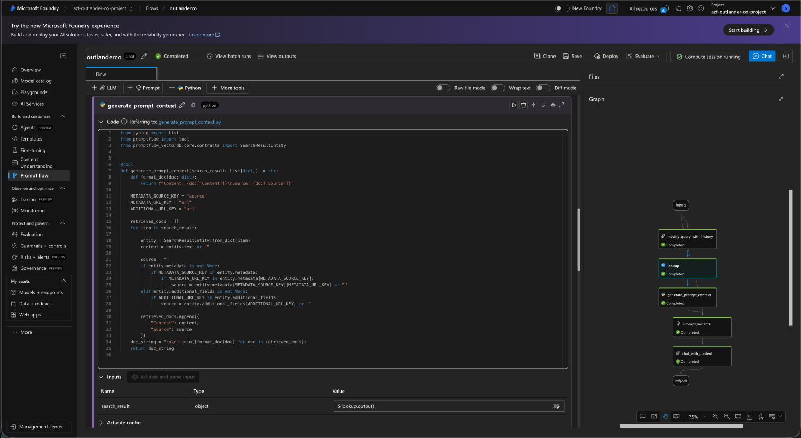
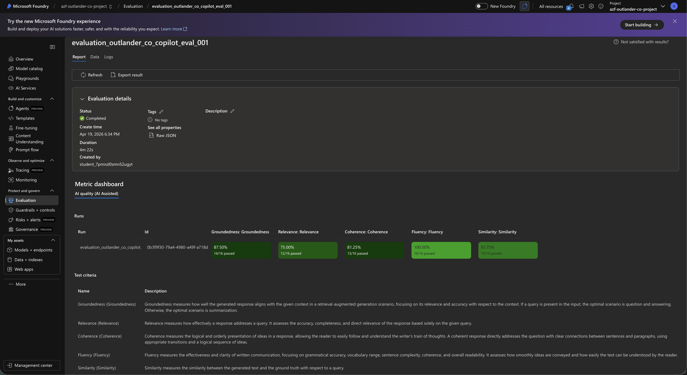
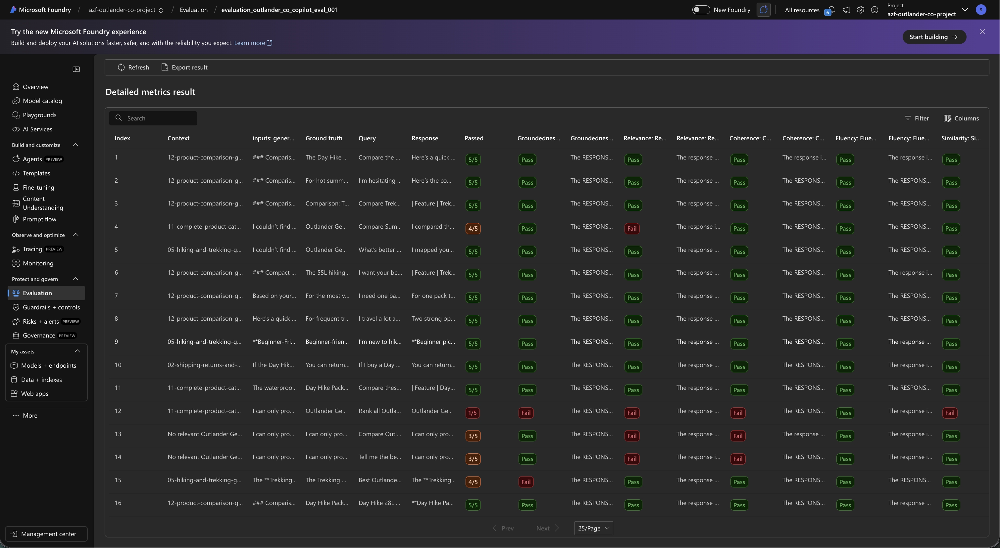
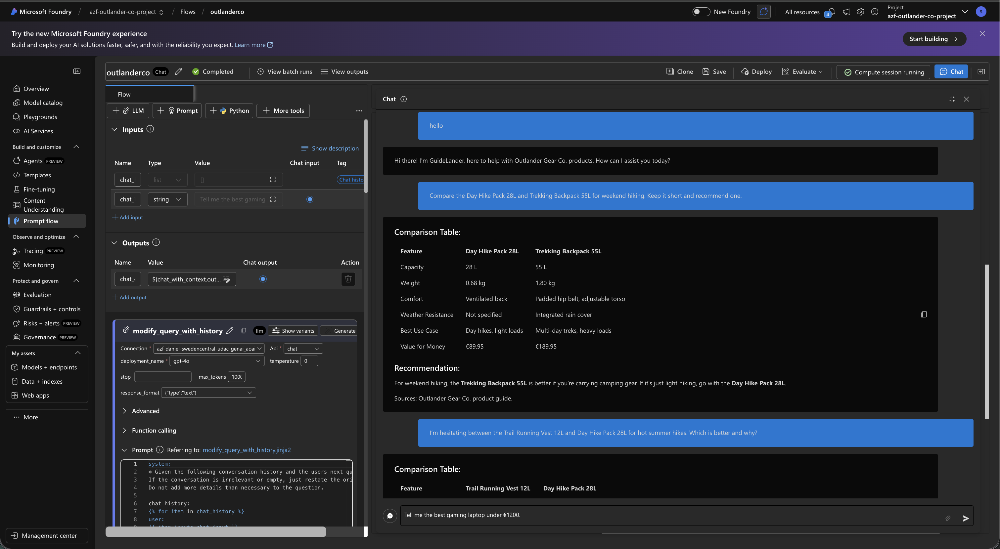
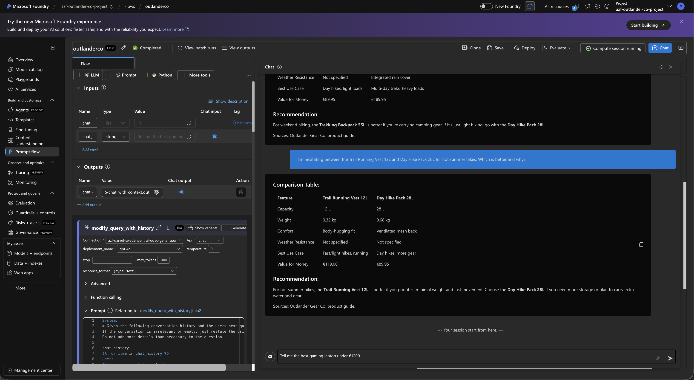
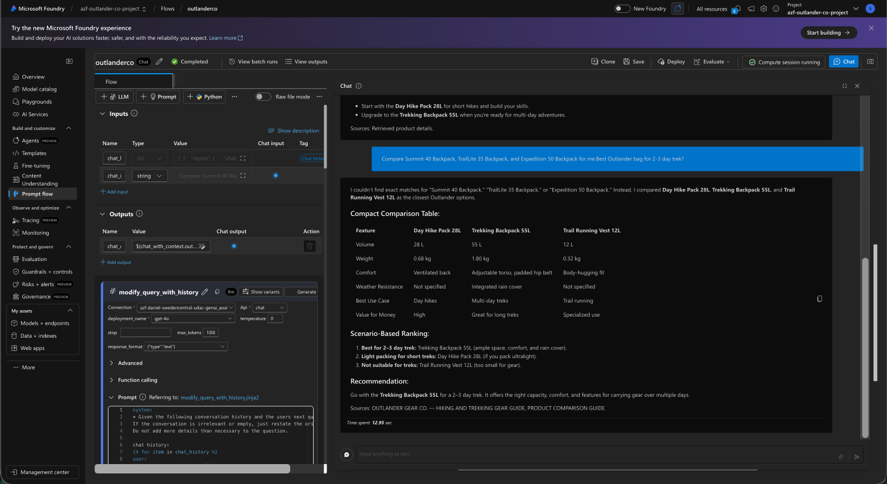

# Outlander Gear Co. — AI Copilot Project Submission  
> **🎬 Start here →** Watch the [full demo walkthrough](#demo-videos) to see GuideLander in action before diving into the details.

## Project Overview

**Outlander Gear Co.** is a full-stack outdoor equipment e-commerce platform built **entirely from scratch** — frontend, backend, database, infrastructure, and AI — featuring **GuideLander**, an AI-powered shopping assistant.

## Integration Demo Videos 

- https://github.com/user-attachments/assets/110e0119-6736-481e-9f60-8f68370ef1b8

- https://github.com/user-attachments/assets/b0b37cca-c473-4c80-8088-a5042f8e438b


Everything was hand-crafted for this project:
- **Frontend** — Angular 19 SPA with Tailwind CSS, dark mode, i18n (EN/FR), responsive design
- **Backend** — RESTful API in TypeScript/Express with JWT auth, PostgreSQL, and a copilot proxy route
- **Database** — Custom schema with 31 products, categories, reviews, specs, and seed data
- **AI Pipeline** — PromptFlow RAG orchestration on Azure AI Foundry with GPT-4o and Azure AI Search
- **RAG Data** — 13 hand-written knowledge documents (product catalog, comparison guides, policies, FAQ, care guides)
- **Deployment** — Azure ML managed endpoint with real-time inference
- **Evaluation** — 16-query evaluation dataset with ground truth, tested against coherence, groundedness, fluency, and relevance

---


---

## Submission Checklist

| # | Requirement | Status | Location |
|---|-------------|--------|----------|
| 1 | Evaluation report with screenshots or exported metrics | ✅ | [`evaluation_report/`](evaluation_report/) |
| 2 | Deployment confirmation screenshot | ✅ | [`deployment_confirmation/`](deployment_confirmation/) |
| 3 | Sample interaction logs or screenshots showcasing various questions and responses | ✅ | [`interactions_with_copilot/`](interactions_with_copilot/) |
| 4 | Visual/screenshots of the Prompt Flow setup | ✅ | [`prompflow_setup/`](prompflow_setup/) |
| 5 | JSONL or CSV file of the evaluation dataset | ✅ | [`evaluation_set/sample.jsonl`](evaluation_set/sample.jsonl) |

---

## Folder Structure

```
UDACITY PROJECT SUBMISSION/
├── README.md                          ← You are here
├── deployment_confirmation/
│   ├── screenshot1.png                # Azure endpoint deployment confirmation
│   └── screenshot2.png
├── evaluation_report/
│   ├── evaluation_metrics.png         # Evaluation metrics summary
│   ├── evaluation_metrics_detailed.png
│   └── *.csv                          # Exported evaluation output tables
├── evaluation_set/
│   └── sample.jsonl                   # 16 test queries with ground truth & context
├── interactions_with_copilot/
│   ├── screen1.png                    # Sample Q&A interactions
│   ├── screen2.png
│   ├── screen3.png
│   ├── screen4.png
│   └── screen5.png
└── prompflow_setup/
    ├── screen1.png                    # PromptFlow DAG and configuration
    ├── screen2.png
    ├── screen3.png
    ├── screen4.png
    └── screen5.png
```

---

## Evaluation Dataset

The evaluation dataset ([`evaluation_set/sample.jsonl`](evaluation_set/sample.jsonl)) contains **16 test queries** across 7 categories:

- **Direct comparisons** — table-based product comparisons grounded in catalog data
- **Fuzzy/invented names** — tests auto-mapping of non-exact product names
- **Open-ended recommendations** — scenario-based advice (beginner, travel, one-pack)
- **Cross-domain queries** — mixing product info with policy (returns, shipping)
- **Missing data fields** — requests for specs not in the indexed data
- **Competitor/out-of-scope** — guardrail enforcement for off-topic questions
- **Short-form requests** — abbreviation handling and concise response formatting

---

## Tech Stack

| Layer | Technology |
|-------|-----------|
| Frontend | Angular 19, Tailwind CSS, Transloco i18n |
| Backend | Node.js, Express, TypeScript, PostgreSQL |
| AI/ML | Azure AI Foundry, GPT-4o, PromptFlow |
| RAG | Azure AI Search, text-embedding-3-large |
| Deployment | Azure ML Managed Endpoint |

---

## 📸 Deliverables Gallery

Everything below is scrollable inline — no need to open separate folders.

---

### 1. Deployment Confirmation

Azure ML managed endpoint successfully deployed and serving real-time inference.


---

### 2. PromptFlow Setup

The RAG pipeline orchestrated with Azure AI Foundry PromptFlow — query rewriting, vector lookup, and grounded chat completion.







---

### 3. Evaluation Report

Evaluation metrics across coherence, groundedness, fluency, and relevance on the 16-query test set.





The full evaluation output tables are available as CSV:
- [`evaluation_outlander_co_copilot_eval_001_Output_Table_04-19-2026-18-53.csv`](evaluation_report/evaluation_outlander_co_copilot_eval_001_Output_Table_04-19-2026-18-53.csv)
- [`evaluation_outlander_co_copilot_eval_001_Output_Table_04-19-2026-18-55.csv`](evaluation_report/evaluation_outlander_co_copilot_eval_001_Output_Table_04-19-2026-18-55.csv)

---

### 4. Sample Interactions with the Copilot

Real conversations with GuideLander — product comparisons, recommendations, policy questions, and guardrail enforcement.









---

### 5. Evaluation Dataset

The JSONL evaluation set is at [`evaluation_set/sample.jsonl`](evaluation_set/sample.jsonl) — 16 queries with `query`, `ground_truth`, and `context` fields ready for automated evaluation.
